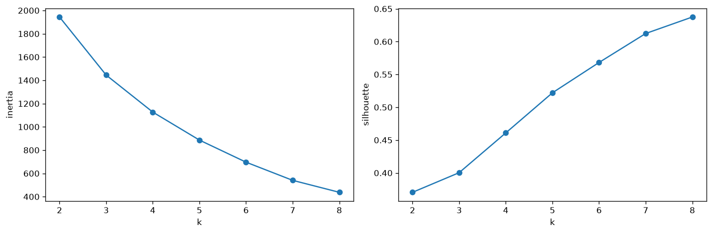
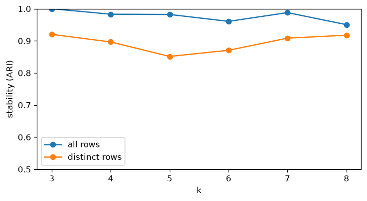

# Clustering notes

How the five groups were built and how much to trust them. The code is in `notebooks/clustering.ipynb`; the reasons behind the choices are in `notebooks/features.ipynb` and in `notebooks/analysis/`.

## The data

The Sleep Health and Lifestyle dataset is synthetic. Values sit on a grid (339 people out of 374 have one of five round step counts), rows repeat (106 distinct rows on the clustering features), and correlations are cleaner than in real people (sleep quality and stress at -0.90).

So the groups describe how the data was generated. What can be reused on real data is the pipeline and the checks. The five profiles would have to be found again.

I keep the repeated rows in the fit. Two people can share the same coarse values without being the same record, and 106 rows would be too few for five groups. The scores below are computed on the distinct rows as well, so that the repeats do not inflate them.

## Features

| feature | how it was built |
|---|---|
| Age, Sleep Duration, Quality of Sleep, Stress Level, Heart Rate | as is |
| Activity Index | average of standardised activity minutes and daily steps (they correlate 0.77) |
| Mean Arterial Pressure | from the two blood pressure numbers (they correlate 0.97) |
| BMI | Normal 0, Overweight 1, Obese 2 |

Everything is standardised before KMeans. There is no outlier treatment: the values sit on a grid, so the extreme ones are rare levels, not errors. The columns are not reduced with PCA because each group has to be described in words later.

Gender and Occupation are not features. Gender because the question is optional in an app, and because as a yes/no column it starts to split the groups by gender once there are more than five of them. Occupation because eleven yes/no columns take over the partition. Sleep Disorder is kept aside to check the groups. Details in `analysis/columns.ipynb`.

## Choosing k

Elbow and silhouette do not give a number here. The inertia curve has no clear bend, and the silhouette keeps rising with k until every distinct row is its own group, with a small first peak at k = 5.

Stability does not either. The test: fit on a random 80% of the rows, use that fit to assign all rows, and count how many people end up in the same groups as with the fit on all rows (adjusted Rand index, 1 means identical). Repeated 50 times, every k from 3 to 8 scores between 0.95 and 1.00, and between 0.85 and 0.92 on the distinct rows. With values on a grid, any partition is easy to find again. A first run of this check with KMeans' default ten restarts showed peaks at 5 and 7; they came from the algorithm stopping at different local optima, and disappear with 200 restarts. All fits now use 200 restarts, and at k = 5 thirty different seeds give the same partition.

So k is a choice for use, not a number the scores give. k = 7 is k = 5 with two groups cut in two. I keep 5 because each group becomes a short written profile for the language model, five are easier to tell apart in words than seven, and the silhouette has its first peak there. Details in `analysis/k.ipynb`.

## The five groups

| cluster | people | in short |
|---|---|---|
| 0 | 101 | Late thirties. Short and poor sleep, high stress, the least active. About half overweight. |
| 1 | 34 | Early fifties, normal BMI. Longest and best sleep, lowest stress, little activity. |
| 2 | 145 | Late thirties, normal BMI. Sleep well, active, lowest blood pressure. |
| 3 | 62 | Around 52, overweight or obese. Sleep well and report low stress, but blood pressure almost as high as cluster 4. |
| 4 | 32 | Around 50, overweight, the most active. Shortest sleep, highest stress, highest blood pressure. |

The descriptions are read from the group means and from the crosstabs with BMI, sleep disorder and gender in `clustering.ipynb`. Two things to keep in mind: clusters 1 and 4 are 9 and 8 distinct rows repeated, and clusters 1, 3 and 4 are almost all women, because gender goes with age in this data.

## Checks

Sleep Disorder was not a feature. Clusters 1 and 2 are almost all without a disorder, cluster 0 holds most of the insomnia, clusters 3 and 4 most of the apnea. Cluster 3 matters for the guidance step: 57 people out of 62 have a disorder, with habits close to the healthy groups. What differs is blood pressure and age.

The match is modest. BMI on its own explains the disorder better than the clusters (0.43 against 0.33 normalised mutual information). I read the check as a confirmation that the groups carry some information about the disorder.

## Limits

- Synthetic data. Silhouette at k = 5 is 0.52 on all rows and 0.43 on the distinct rows, against 0.13 for shuffled data; on real measurements it would be lower, and k would have to be chosen again because here no score separates one k from another.
- Two groups are a handful of rows repeated.
- Four of the five groups are one BMI category. Removing BMI keeps most of the partition (ARI 0.89), but the groups are partly a BMI split.
- Three groups are almost all women, so the guidance will differ by gender even though gender is not an input.
- No Underweight users in the data. The code rejects such a row.

## What I would try next

With real data: choose k again, compare heart rate and blood pressure with the norm of the same gender before clustering, and try k = 7 in the guidance step to see whether two more profiles change the advice.
